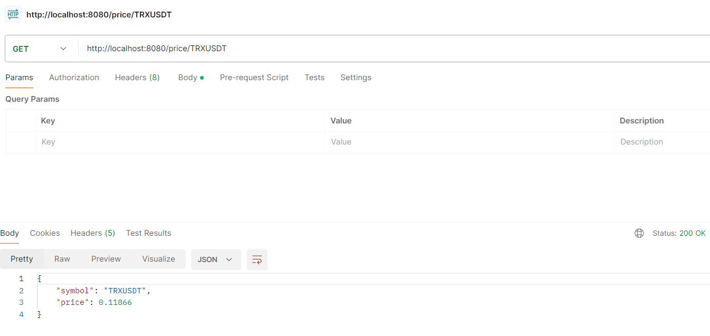
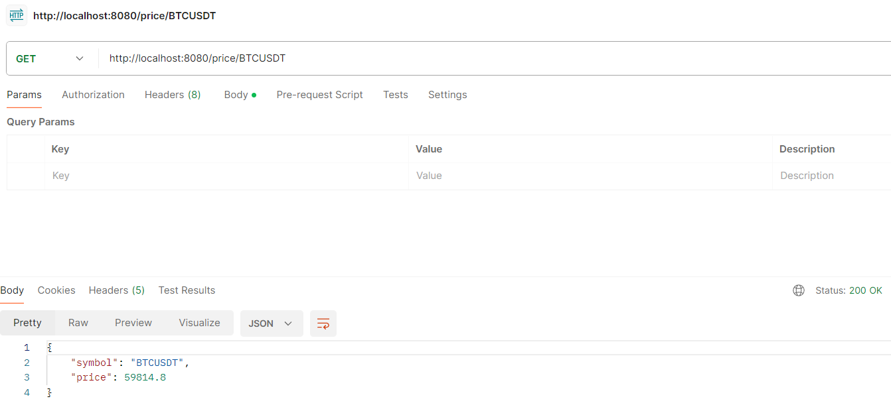
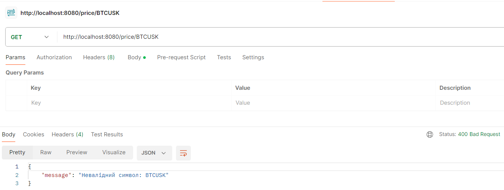

# Crypto Price Controller

This project is a simple controller that provides the current price for cryptocurrency pairs (e.g., BTCUSDT, ETHUSDT).

## Overview

The controller retrieves prices from a storage that is asynchronously populated using the [Binance API](https://binance-docs.github.io/apidocs/futures/en/#mark-price) mark price field.

### Getting Started
To run the project, follow these steps:

1. Clone the repository: `git clone https://github.com/MaksymChalyi/crypto-price-controller.gits`
2. Open the project in your preferred IDE.
3. Configure the database connection in the `application.properties` file by replacing placeholders with actual database URL, username, and password.
4. Build the project using Maven.
5. Run the application.

## Usage

### Get Price

To retrieve the current price for a cryptocurrency pair, send a GET request to the following endpoint:

```
GET /price/{pair}
```

Replace `{pair}` with the desired cryptocurrency pair (e.g., `BTCUSDT`, `ETHUSDT`).

Example:

```
GET /price/BTCUSDT
```

Response:

```json
{
  "symbol": "BTCUSDT",
  "price": 59785.13
}
```
Screenshots:




if we write not valid symbols:


## Configuration

The application uses the following configuration properties, which can be set in the `application.properties` file:

- `DB_LINK`: Database URL
- `DB_USERNAME`: Database username
- `DB_PASSWORD`: Database password

## Contributing

Contributions are welcome! Feel free to submit issues or pull requests.

### License
This project is licensed under the MIT License. See the [LICENSE](LICENSE.md) file for details.


----

**Developed by Maksym Chalyi in 2024.**